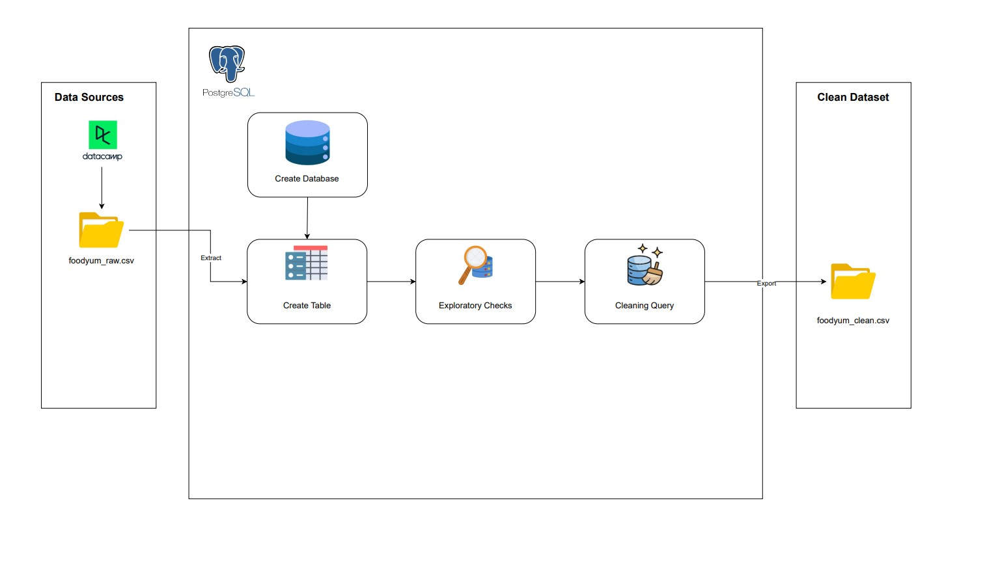

# FoodYum Grocery Store Sales: Data Cleaning Project with PostgreSQL

### Project Architecture:
> 

## Table of Contents
1. [Introduction](#introduction)
2. [Objectives](#objectives)
3. [Dataset Description](#dataset-description)
4. [Tools & Environment](#tools--environment)
5. [Project Structure](#project-structure)
6. [Database Schema](#database-schema)
7. [Data Ingestion](#data-ingestion)
8. [Data Cleaning Process](#data-cleaning-process)
   - [8.1 Exploratory Checks](#81-exploratory-checks)
   - [8.2 Cleaning Query](#82-cleaning-query)
9. [Validation & Testing](#validation--testing)
10. [Conclusion](#conclusion)
11. [Appendix](#appendix)

---

## Introduction
This project focuses on cleaning the FoodYum Grocery Store Sales dataset using PostgreSQL. The goal is to transform raw transaction records into a consistent, analysis-ready table by handling missing values, standardizing formats, and applying business rules.

## Objectives
- Identify and resolve missing or malformed values.
- Standardize categorical fields and numeric formats.
- Replace missing values with appropriate defaults (e.g., median for continuous fields).
- Prepare a clean `products` table for downstream analytics.

## Dataset Description
**FoodYum Grocery Store Sales**
- FoodYum is a U.S.-based grocery chain selling produce, meat, dairy, bakery, snacks, and household staples.
- As food costs rise, the company needs consistent data to ensure broad product availability across price ranges.
- The raw dataset captures product metadata and sales metrics for the last full year of the loyalty program.

| Column               | Type      | Description                                                                                     |
|----------------------|-----------|-------------------------------------------------------------------------------------------------|
| product_id           | INTEGER   | Unique identifier for each product                                                              |
| product_type         | TEXT      | Category (Produce, Meat, Dairy, Bakery, Snacks); missing → `Unknown`                            |
| brand                | TEXT      | Brand name; missing or `-` → `Unknown`                                                          |
| weight               | TEXT      | Weight in grams (e.g., `500 grams`); extract numeric value and round to 2 decimals; missing → median weight |
| price                | NUMERIC   | Price in USD; missing → median price                                                           |
| average_units_sold   | INTEGER   | Average monthly units sold; missing → `0`                                                       |
| year_added           | INTEGER   | Year first added to stock; missing → `2022`                                                     |
| stock_location       | TEXT      | Warehouse code (`A`,`B`,`C`,`D`); normalize to uppercase; missing → `Unknown`                    |

## Tools & Environment
- **Database:** PostgreSQL v17
- **GUI:** pgAdmin 4
- **Optional Scripting:** Python 3.x with `psycopg2`, `pandas`
- **Environment Variables:** Store DB credentials in a `.env` file (not committed to VCS)

## Project Structure
```
foodyum-data-cleaning/
├── data/
│   ├── raw/                    # Original CSV files
│   │   ├── foodyum_raw.csv
│   │   └── foodyum_raw_for_pgadmin4.csv
│   └── clean/                  # Exported cleaned CSV
│       └── foodyum_clean.csv
├── sql/
│   ├── 01_create_tables.sql    # Table definitions
│   ├── 02_data_ingestion.sql   # COPY commands
│   ├── 03_data_cleaning.sql    # Cleaning queries
│   └── 04_data_validation.sql  # Data quality checks
├── .env                        # DB credentials
├── README.md                   # Project documentation
└── requirements.txt            # Python dependencies
```

## Database Schema
Table: `products`

```sql
CREATE TABLE public.products (
  product_id           INTEGER PRIMARY KEY,
  product_type         TEXT,
  brand                TEXT,
  weight               TEXT,
  price                NUMERIC,
  average_units_sold   INTEGER,
  year_added           INTEGER,
  stock_location       TEXT
);
ALTER TABLE public.products OWNER TO postgres;
```

## Data Ingestion
Load the raw CSV into the `products` table:
```sql
\copy products FROM 'path/to/foodyum_raw_for_pgadmin4.csv' CSV HEADER;
```

## Data Cleaning Process

### 8.1 Exploratory Checks
```sql
-- 1. product_type distribution
SELECT product_type, COUNT(*) AS cnt
FROM products
GROUP BY product_type;

-- 2. brand distribution (including '-' placeholder)
SELECT brand, COUNT(*) AS cnt
FROM products
GROUP BY brand;

-- 3. Inspect weight format
SELECT DISTINCT weight
FROM products
LIMIT 10;

-- 4. price summary
SELECT MIN(price), MAX(price), AVG(price)
FROM products;

-- 5. average_units_sold summary
SELECT MIN(average_units_sold), MAX(average_units_sold), AVG(average_units_sold)
FROM products;

-- 6. missing year_added
SELECT COUNT(*)
FROM products
WHERE year_added IS NULL;

-- 7. stock_location variations
SELECT stock_location, COUNT(*)
FROM products
GROUP BY stock_location;
```

### 8.2 Cleaning Query
```sql
WITH clean AS (
  SELECT
    product_id,
    COALESCE(NULLIF(product_type, ''), 'Unknown')       AS product_type,
    COALESCE(NULLIF(brand, '-'), 'Unknown')            AS brand,
    NULLIF(SPLIT_PART(weight, ' ', 1), '')::NUMERIC    AS weight,
    price,
    COALESCE(average_units_sold, 0)                    AS average_units_sold,
    COALESCE(year_added, 2022)                         AS year_added,
    UPPER(COALESCE(stock_location, 'Unknown'))         AS stock_location
  FROM products
),
med AS (
  SELECT
    PERCENTILE_CONT(0.5) WITHIN GROUP (ORDER BY weight) AS median_weight,
    PERCENTILE_CONT(0.5) WITHIN GROUP (ORDER BY price)  AS median_price
  FROM clean
  WHERE weight IS NOT NULL AND price IS NOT NULL
)

SELECT
  c.product_id,
  c.product_type,
  c.brand,
  ROUND(COALESCE(c.weight, m.median_weight), 2) AS weight,
  ROUND(COALESCE(c.price,  m.median_price),  2) AS price,
  c.average_units_sold,
  c.year_added,
  c.stock_location
FROM clean c
CROSS JOIN med m;
```

## Validation & Testing
- Verify no NULLs remain:
  ```sql
  SELECT COUNT(*)
  FROM (
    SELECT * FROM cleaned_products
  ) t
  WHERE product_type IS NULL
    OR brand IS NULL
    OR weight IS NULL
    OR price IS NULL
    OR stock_location IS NULL;
  ```
- Check data types and ranges (e.g., weight > 0, price > 0).

## Conclusion
The cleaning pipeline standardizes text fields, handles missing values with domain-specific defaults, and ensures numeric columns are cast correctly. The resulting `cleaned_products` table is ready for analytics and reporting.

## Appendix
- SQL Scripts:
  - `sql/01_create_tables.sql`
  - `sql/02_data_ingestion.sql`
  - `sql/03_data_cleaning.sql`
  - `sql/04_data_validation.sql`
- Cleaned data export: `data/clean/foodyum_clean.csv`

